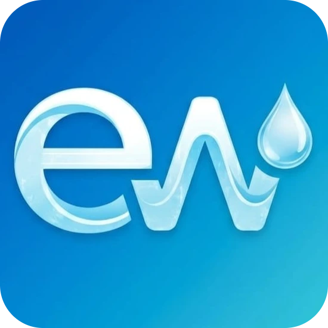
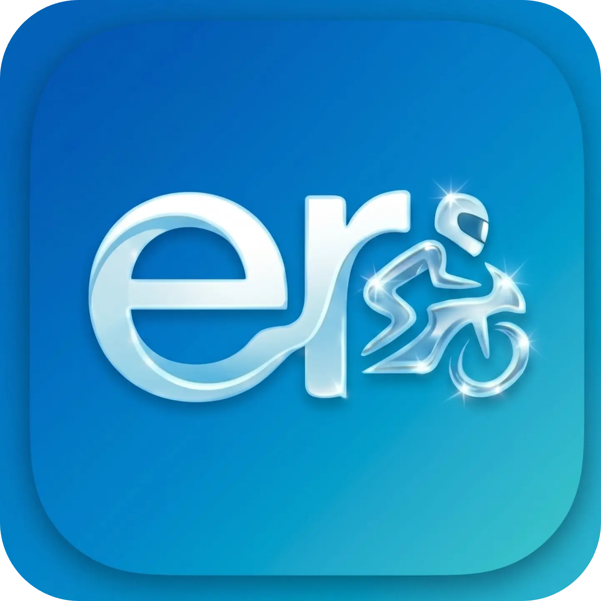

  

  <h1>Hi 👋, I'm Imran Hasan</h1>
  
<b> Flutter & Dart New Learner • UI/UX Enthusiast • Vibe Coder</b>

## 💡 About Me

- 🎓 Final Year BSc in CSE Student
- 🚀 Studying at Shyamoli Engineering College
- 📱 Building apps with **Flutter & Dart**  
- 🎨 Focused on **UI/UX & smooth experience**    
- 📚 Continuously learning and improving  

## 🚀 My Projects

Click any app to download and test

## 🛠️ Tech Stack

## 📊 GitHub Stats

  
<!-- Main Stats -->

<!-- Languages -->

 

<!-- Streak -->

## 🌐 Connect

  

