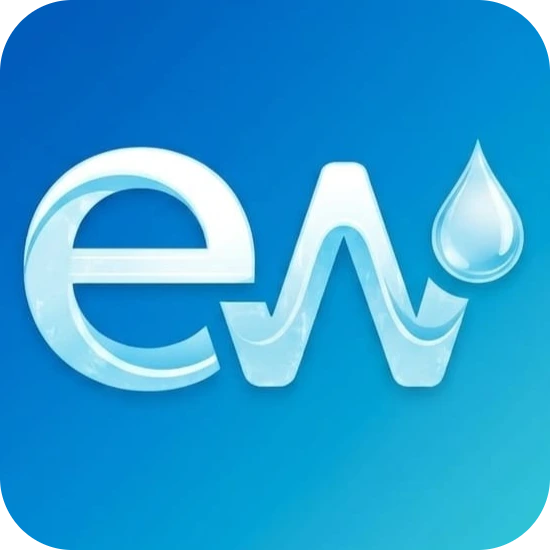
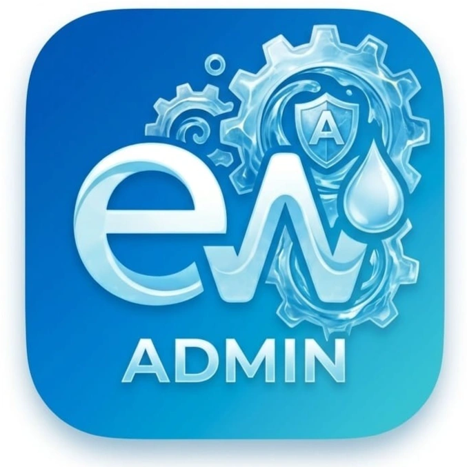
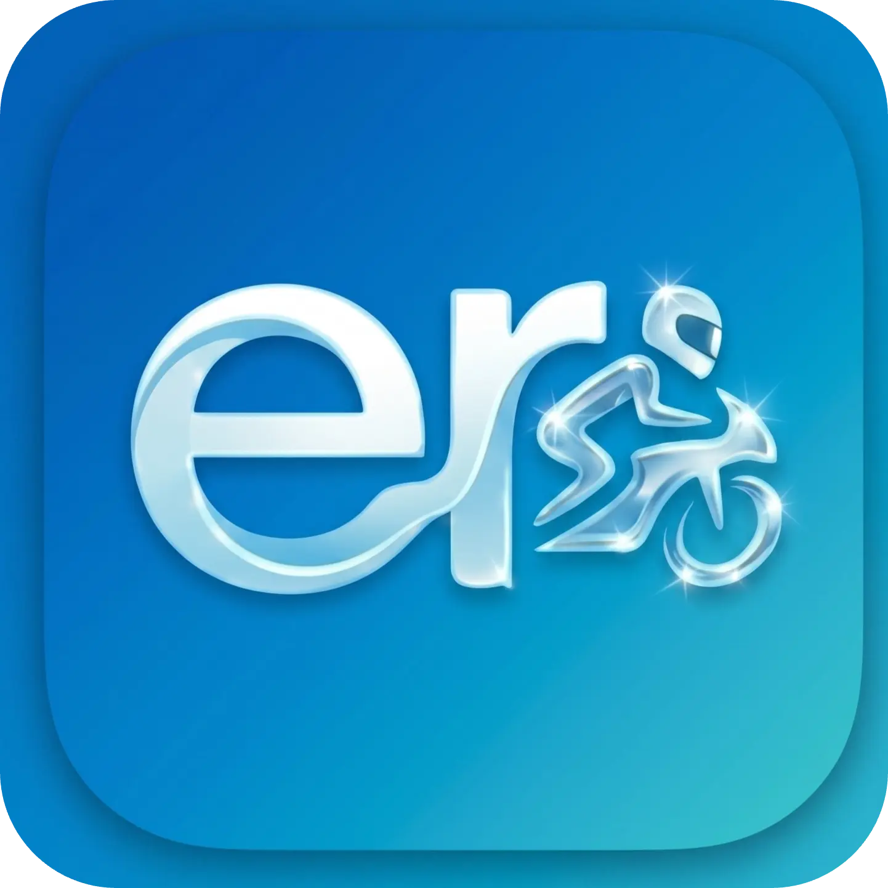
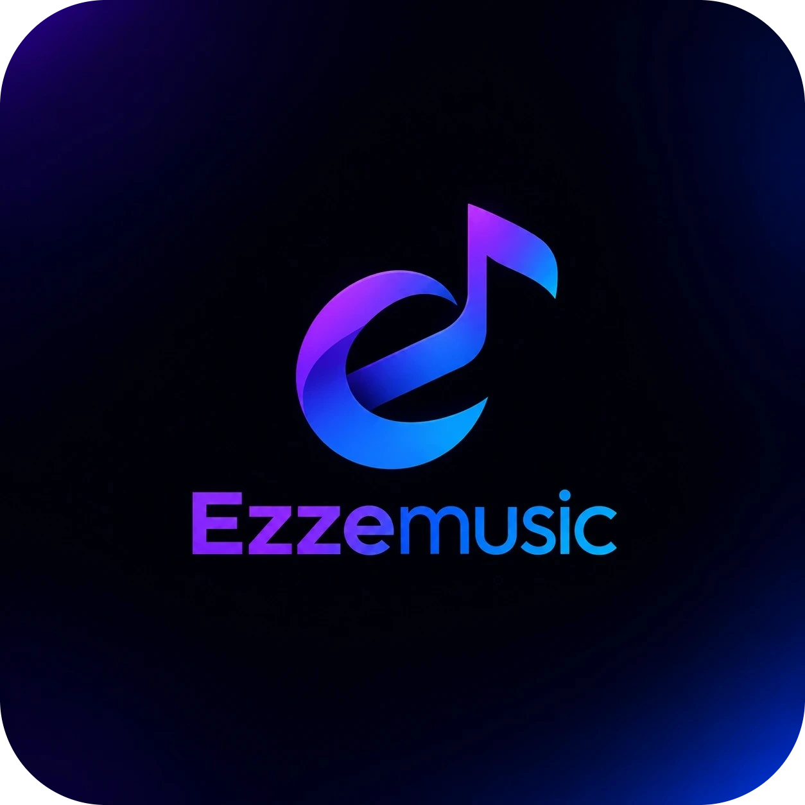
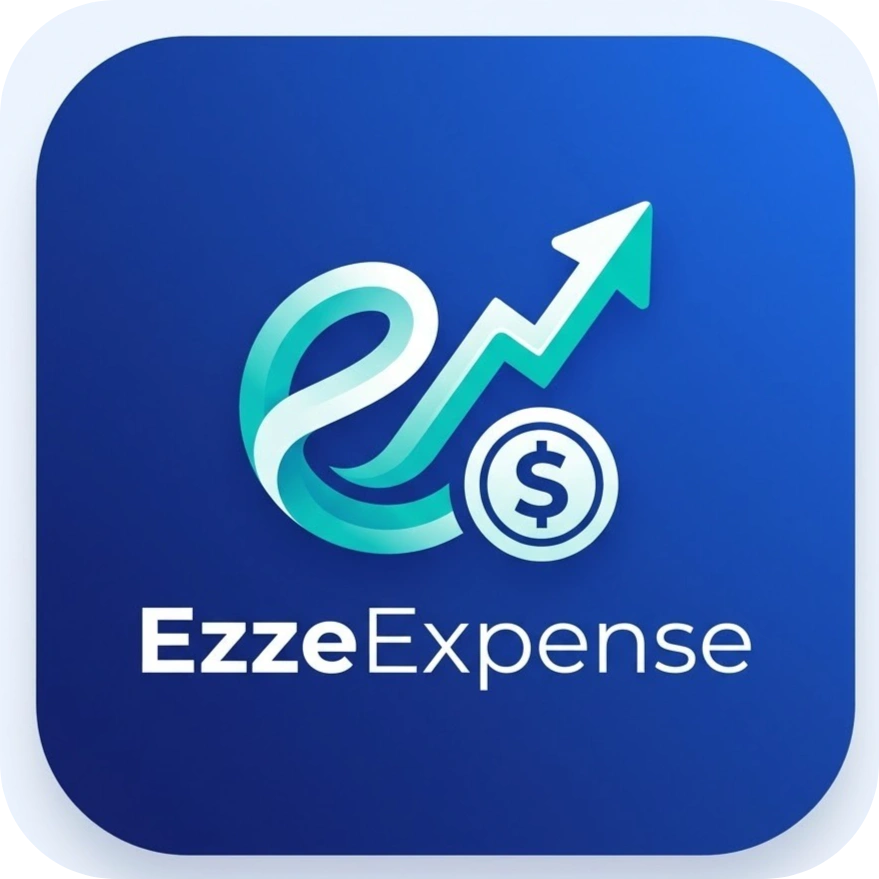
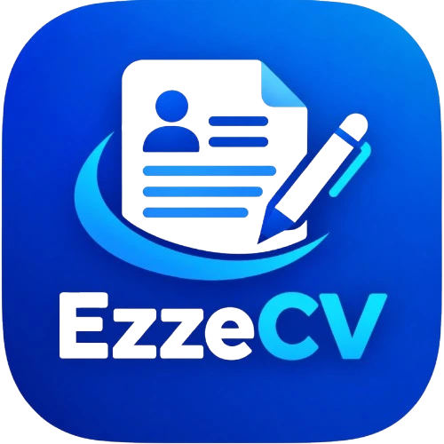
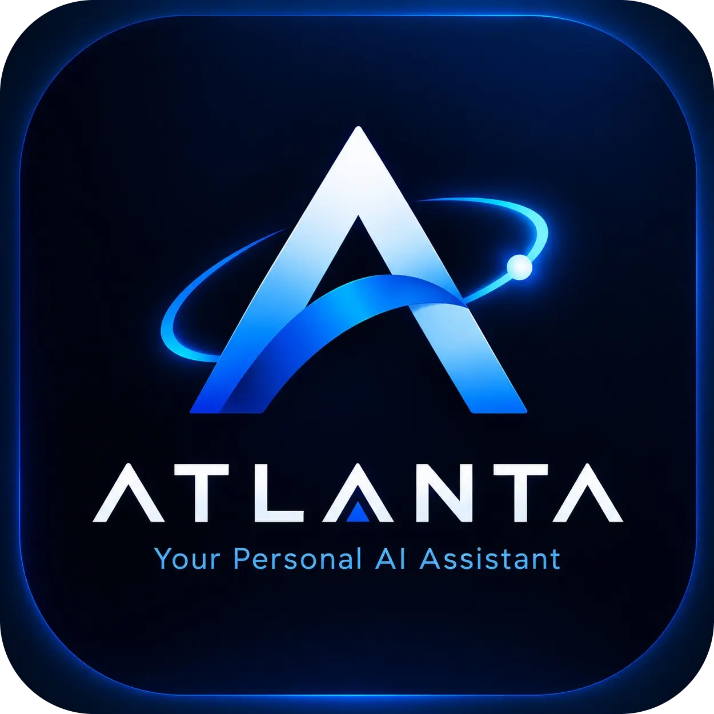

  

  
 <h3><b><i>Building practical software with a focus on clean interfaces, useful features, and better user experiences.</i></b></h3> 

  <h3><i>Connect with me</i></h3>

## 💡 About Me

Hi 👋, I'm <b>Imran Hasan</b>, a Computer Science & Engineering graduate from Shyamoli Engineering College, with a strong interest in mobile application development, UI/UX design, and practical software engineering.

I enjoy turning ideas into functional applications and experimenting with different technologies to understand how real-world software is designed and built. I have expertise in managing software development projects and making user friendly near perfect softwares.

- 📱 Focused on Flutter & Dart
- 🎨 Interested in UI/UX Design & Product Experience
- 💻 Building practical mobile and desktop applications
- 🚀 Developing projects under the Ezze ecosystem
- 📖 Continuously learning and improving my development skills

## 🎓 Education
- 🎓 Bachelor of Science in Computer Science & Engineering
- 🏫 Shyamoli Engineering College (University of Dhaka Affiliated College)
- 📚 Session: 2020–2021
- 💡Focused Areas: Software Development, Programming, Databases, Networking, Web & Mobile Technologies 

## 🚀 My Projects

  <h2><b><i>Click any app icon to download and test</i></b></h2>

  

<i><b>My BSc. Final Year Project</b></i>

 

<b><i>More Personal Projects</b></i>

## 🛠️ Tech Stack

 

 

  

